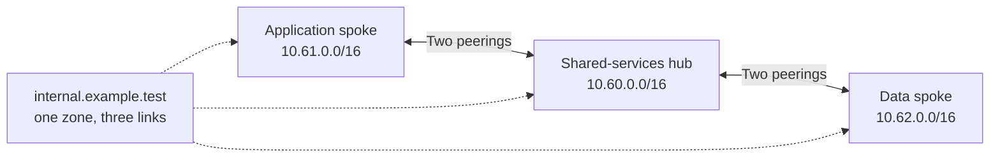

# Hub and two spokes — VNet/DNS leaf

This standalone example creates three resource groups, three VNets, one workload subnet per VNet, four directional peering links, NSGs/routes and a shared private DNS zone linked to all three networks. All names and addresses are synthetic. It demonstrates a complete network topology without provisioning application workloads.



| Role | VNet range | Workload subnet | Intended inbound traffic |
| --- | --- | --- | --- |
| Hub | `10.60.0.0/16` | `10.60.1.0/24` shared-services | HTTPS from both spoke subnets |
| Application spoke | `10.61.0.0/16` | `10.61.1.0/24` application | HTTPS from the hub subnet |
| Data spoke | `10.62.0.0/16` | `10.62.1.0/24` data | HTTPS from the hub subnet |

## Ownership and policy

The local VNet module creates each VNet and the hub private zone/link. This example creates subnets, NSGs, route tables and their associations directly, because those resources are outside the VNet leaf interface.

The policy is visible in `policy.tf`.

NSGs allow the intended HTTPS sources, then deny other `VirtualNetwork` ingress at priority 4000 before Azure's built-in broad allow rule. Outbound policy allows `AzureMonitor` HTTPS and denies other Internet traffic. Adapt the policy to real application dependencies; it does not claim that every Azure monitoring agent or authentication flow works with only this tag. DNS uses Azure-provided resolution; registration is disabled and the zone initially contains no application records. Add records for real workloads after their private addresses are known.

Every subnet explicitly disables default outbound access. The `monitoring-direct` UDR sends the `AzureMonitor` service tag to `Internet`; it contains no `0.0.0.0/0` blackhole or invented appliance address. A route is not an egress service. With the default `enable_nat_gateway=false`, public endpoint access remains unavailable unless you supply another explicit egress mechanism.

Set `enable_nat_gateway=true` to create one Standard NAT gateway and Standard public IP **per network**, with both required associations. These are billable resources. The NSG still restricts Internet destinations. A hub NAT gateway cannot supply egress to peered spokes. This option demonstrates direct outbound connectivity; it does not inspect traffic or add a firewall.

## Validate without Azure access

From this directory, with Terraform 1.16.3 installed:

```sh
terraform init -backend=false -lockfile=readonly
terraform fmt -check -recursive
terraform validate
terraform test
```

The four test runs use mocked AzureRM resources, including mocked applies. They check distinct hub/spoke IDs, both peering directions, gateway/forwarding flags, DNS ownership/links, subnet policy and CSV propagation, the configurable prefix, invalid inputs and optional NAT associations. They never call Azure. The committed provider lock selects AzureRM 4.81.0 within the module's supported >=4.33,<5 range.

## Deploy an intentional disposable example

Use a fresh state and an Azure subscription where you can create the listed network resources. Configure Azure authentication and `ARM_SUBSCRIPTION_ID`. The example has no backend block; configure a protected backend before team use, or keep local state private for a disposable test.

```sh
terraform init -lockfile=readonly
terraform plan -out=example.tfplan -var='name_prefix=portfolio'
# Review the saved plan before this explicit, chargeable operation:
terraform apply example.tfplan
```

For the optional public egress path, add `-var='enable_nat_gateway=true'` to the plan command. Terraform orders VNet/subnet creation, policy association, peerings and DNS links within one state; no seed hub apply is required. Outputs identify the VNets, subnets and optional gateways. Deploy test workloads separately, listen on TCP 443, then verify effective routes/NSGs and DNS records from each linked VNet. Mock tests do not establish live connectivity. Review a destroy plan when the disposable example is no longer needed, and use the same input values/state.

## Boundaries

Peering is **not transitive**: application and data spokes cannot reach one another through the hub simply because both are peered to it. There is no direct spoke-to-spoke peering, forwarding appliance, gateway transit, Azure Firewall, VPN, ExpressRoute, AKS or application gateway. Shared DNS links enable resolution; they do not create a network route or permit traffic. A future inspected transit design needs an actual appliance, matching routes, forwarding/peering settings and firewall rules. Do not add a default route to an unused hub IP.

This example uses one subscription and one region. Review address planning, RBAC, regional availability, Azure Policy, DNS architecture, egress dependencies and costs before adapting it. Private DNS and peering traffic can incur charges; opt-in NAT adds hourly/data-processing and public-IP charges.

Microsoft references: [peering limitations](https://learn.microsoft.com/en-us/azure/virtual-network/virtual-network-manage-peering), [private DNS links](https://learn.microsoft.com/en-us/azure/dns/private-dns-virtual-network-links), [explicit outbound access](https://learn.microsoft.com/en-us/azure/virtual-network/ip-services/default-outbound-access), [service-tag routes](https://learn.microsoft.com/en-us/azure/virtual-network/service-tags-overview).
